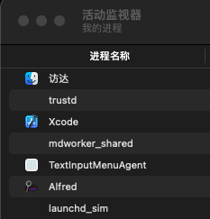
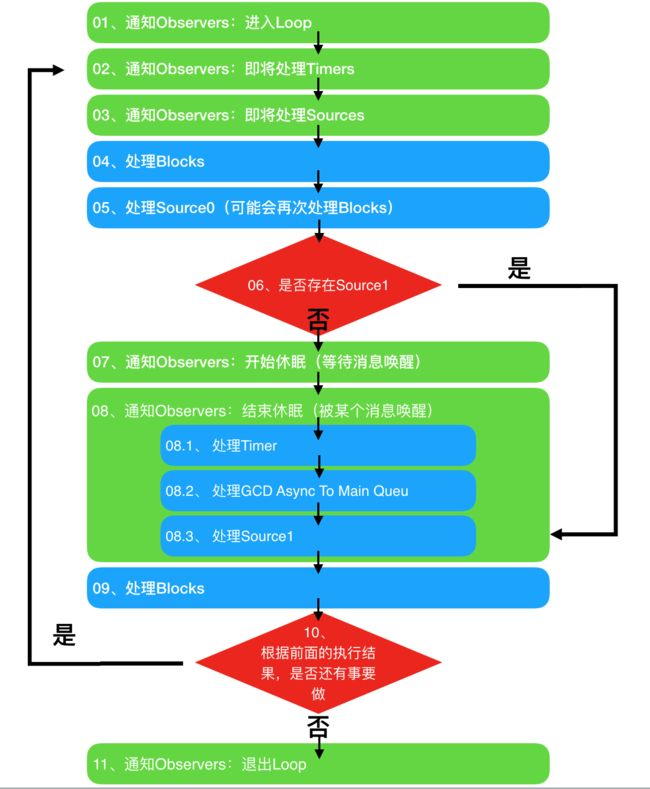

> Runloop与线程的关系？

### 1. Runloop和线程概述

##### 1.1 什么是线程？

我们应该都干过这样一件事情：打开电脑，带上耳机，打开音乐播放器播放一首喜欢的歌曲，打开浏览器搜索问题，打开Word查看产品需求，打开你的IDE开始撸代码，偶尔还要回个微信消息，看点八卦杂志。也就是说，同一时间，我们的电脑在做多项任务。

现代操作系统比如Mac OS X，Unix，Linux，Windows都是支持这样的多任务的操作系统。而这些任务的执行者就是电脑的核心\--CPU。现在多核的CPU太常见了，但是在早期，单核的CPU也是能够执行多任务的。由于CPU在执行代码时总是顺序执行的，那么单核CPU是怎么实现多任务呢？

答案是CPU会在多个任务之间快速的来回切换，A任务执行0.01秒，然后B任务执行0.01秒，然后C任务执行0.01秒，再跳回A任务执行...，虽然表面上看起来是交替执行，但是天下武功无快不破，由于CPU的执行速度太快了，我们感觉就像是所有任务都同时在执行一样。

对于操作系统来说，一个任务就是一个进程（Process），例如你打开QQ就是开启了一个QQ的进程，打开微信就是开启了一个微信的进程，可以在活动监视器里查看当前系统开启的进程：



我们可以把进程和应用程序（Application）画等号来理解它。

当你打开QQ和某个小伙伴探讨人生哲学时，你会一边打字，同时你可能收到他给你的回复，也许你还会秀一下你的外语（开启自动翻译功能^_^）。这时候我们会同时干多个事情，也就是子任务，而线程（Thread）就是来执行这些子任务的对象。


> 1. 进程是CPU进行资源分配的最小单位；
> 2. 线程是CPU进行任务调度的最小单位；
> 3. 一个进程至少需要一个线程；

##### 1.2 什么是Runloop？

上面我们知道，一个应用程序就是一个进程，一个进程至少需要1个或多个线程来执行任务。这就已经很完美了，为什么需要`Runloop`呢？

事实上，当线程执行完毕之后就会自动结束，释放CPU资源，而一个进程至少有需要1个线程，那么如果这个线程执行完了就不能够被释放，需要它继续等待下一次任务的执行，这就产生了一个问题：如何让这个线程等待呢？这就是`Runloop`的作用了。

在[苹果官方文档](https://developer.apple.com/library/archive/documentation/Cocoa/Conceptual/Multithreading/RunLoopManagement/RunLoopManagement.html#//apple_ref/doc/uid/10000057i-CH16-SW47)中这样解释：

> Run loops are part of the fundamental infrastructure associated with threads. A *run loop* is an event processing loop that you use to schedule work and coordinate the receipt of incoming events. The purpose of a run loop is to keep your thread busy when there is work to do and put your thread to sleep when there is none.

大概意思是说：

> `Runloop`是一个与线程相关的基础结构中的一部分。是一个调度和处理任务的事件循环。目的是让线程在有任务时执行任务，没有任务时进入睡眠状态。

简单地说`Runloop`就是一种循环机制，让线程在有任务时工作，没有任务时睡眠。

### 2. Runloop与线程

通过上面的介绍，我们应该了解到`Runloop`和线程是息息相关的、密不可分的。线程是执行任务的对象，`Runloop`则是帮助线程控制状态，避免线程执行完就直接结束的东西。那么它们之间的关系究竟如何呢？

同样[苹果官方文档](https://developer.apple.com/library/archive/documentation/Cocoa/Conceptual/Multithreading/RunLoopManagement/RunLoopManagement.html#//apple_ref/doc/uid/10000057i-CH16-SW47)中这样解释：

> Run loop management is not entirely automatic. You must still design your thread’s code to start the run loop at appropriate times and respond to incoming events. Both Cocoa and Core Foundation provide run loop objects to help you configure and manage your thread’s run loop. Your application does not need to create these objects explicitly; each thread, including the application’s main thread, has an associated run loop object. Only secondary threads need to run their run loop explicitly, however. The app frameworks automatically set up and run the run loop on the main thread as part of the application startup process.

大概意思是说：

> `Runloop`的管理并非自动的。在开启线程时，你需要自己来启动`Runloop`和响应传入的事件。`Cocoa`和`Core Foundation`框架都提供了帮助管理和配置`Runloop`的对象，我们无需自行创建`Runloop`对象，每个线程包括主线程都已经关联了一个`Runloop`对象，但是，子线程我们来启动`Runloop`，在程序启动时，主线程就自动的配置好并运行了一个`Runloop`对象。

由此可知：

> 1. `Runloop`和线程是绑定的，它们存在一一对应的关系；
> 2. `Runloop`是由系统进行创建管理的，你只能获取不能创建；
> 3. 主线程的`Runloop`在程序启动时就开启了，子线程的`Runloop`需要我们手动开启；

### 3. 源码解析

##### 3.1 系统是如何创建和管理Runloop的？

在[CF-1153.18的源码](https://opensource.apple.com/source/CF/CF-1153.18/CFRunLoop.c.auto.html)中可以看到，只提供了

```c
CF_EXPORT CFRunLoopRef CFRunLoopGetCurrent(void);
CF_EXPORT CFRunLoopRef CFRunLoopGetMain(void);
```

这两个函数去获得`Runloop`对象，所以我们只能获取而不能创建。事实上，这两个函数都是通过`_CFRunLoopGet0`的具体实现来获取`Runloop`的

```c
/// 用于存放Runloop的全局字典，key是pthread_t，value是CFRunloopRef
static CFMutableDictionaryRef __CFRunLoops = NULL;
/// 访问__CFRunLoops时的锁
static CFLock_t loopsLock = CFLockInit;

CF_EXPORT CFRunLoopRef _CFRunLoopGet0(pthread_t t) {
    // 如果传入的线程是空，那么默认为主线程
    if (pthread_equal(t, kNilPthreadT)) {
        t = pthread_main_thread_np();
    }
    __CFLock(&loopsLock);
    
    // 第一次访问时，初始化__CFRunLoops字典，并且为主线程创建一个Runloop
    // 保证了无论什么时候，主线程的Runloop一定会存在
    if (!__CFRunLoops) {
        __CFUnlock(&loopsLock);
        // 创建一个临时的字典
        CFMutableDictionaryRef dict = CFDictionaryCreateMutable(kCFAllocatorSystemDefault, 0, NULL, &kCFTypeDictionaryValueCallBacks);
        // 为主线程创建一个Runloop
        CFRunLoopRef mainLoop = __CFRunLoopCreate(pthread_main_thread_np());
        // 把主线程的Runloop放到字典中
        CFDictionarySetValue(dict, pthreadPointer(pthread_main_thread_np()), mainLoop);
        // 将临时字典中的数据写入到__CFRunLoops全局字典中，并释放临时字典
        if (!OSAtomicCompareAndSwapPtrBarrier(NULL, dict, (void * volatile *)&__CFRunLoops)) {
            CFRelease(dict);
        }
        // 由于已经将Runloop存到__CFRunLoops字典中，临时的mainRunloop指针就可以释放了
        CFRelease(mainLoop);
        __CFLock(&loopsLock);
    }
    
    // 根据传入的线程在__CFRunLoops中获取Runloop
    CFRunLoopRef loop = (CFRunLoopRef)CFDictionaryGetValue(__CFRunLoops, pthreadPointer(t));
    __CFUnlock(&loopsLock);
    // 如果没有获取到Runloop
    if (!loop) {
        // 为当前线程t创建一个Runloop
        CFRunLoopRef newLoop = __CFRunLoopCreate(t);
        __CFLock(&loopsLock);
        // 问题1：按理说创建了一个新的Runloop就应该执行下面的存储到全局字典的操作，但是为什么还要在锁里面重新从全局字典中获
        // 取一次呢？
        loop = (CFRunLoopRef)CFDictionaryGetValue(__CFRunLoops, pthreadPointer(t));
        if (!loop) {
            // 将新创建的Runloop存入到__CFRunLoops全局字典中
            CFDictionarySetValue(__CFRunLoops, pthreadPointer(t), newLoop);
            loop = newLoop;
        }
        // don't release run loops inside the loopsLock, because CFRunLoopDeallocate may end up taking it
        __CFUnlock(&loopsLock);
        CFRelease(newLoop);
    }
    // 如果为当前线程
    if (pthread_equal(t, pthread_self())) {
        // 将Runloop设置为当前线程的私有数据（Thread-specific data）。此时，不仅仅在__CFRunLoops这个全局的字典中保存
        // 还在线程的私有数据的__CFTSDKeyRunLoop下标下对应存储。所以，在对外的两个方法中并非直接调用本方法获取Runloop
        // 而是先从线程私有数据中获取的
        _CFSetTSD(__CFTSDKeyRunLoop, (void *)loop, NULL);
        // 判断是否已经设置了Runloop在线程私有数据中的析构函数，如果没有则需要注册
        if (0 == _CFGetTSD(__CFTSDKeyRunLoopCntr)) {
            // 注册回调，当线程销毁时，自动销毁Runloop，__CFFinalizeRunLoop是Runloop的析构函数
            // 这里和上面的设置Runloop为线程私有数据类似，只是这里设置的是析构函数，当线程析构时会调用这里保存的析构函数
            _CFSetTSD(__CFTSDKeyRunLoopCntr, (void *)(PTHREAD_DESTRUCTOR_ITERATIONS-1), (void (*)(void *))__CFFinalizeRunLoop);
        }
    }
    return loop;
}
```

从源码中，可以看出`Runloop`的的确确和线程是一一对应的，其关系保存在一个名为`__CFRunLoops`的全局字典中，除此之外，线程也会将`Runloop`及其析构函数保存在其私有数据中。`Runloop`并不会主动创建，而是在获取时创建（懒加载？），`Runloop`的销毁是在线程结束时一并销毁的。由于对外接口中并没有线程的参数，那么只能在对应线程中获取它的`Runloop`，主线程除外。

* 问题1：按理说创建了一个新的Runloop就应该执行下面的存储到全局字典的操作，但是为什么还要在锁里面重新从全局字典中获取一次呢？

假设某些并发任务中，都调用了`_CFRunLoopGet0`方法，好巧不巧的还都传入了同一个线程，当他们都为当前线程创建了一个`Runloop`后，直接执行写操作，那么一定会存在一个覆盖的情况，那么你每个任务执行时获得的都是你新创建出来的`Runloop`就失去了用来保活线程的意义，而且在覆盖后，并没有将原来保存的`Runloop`释放，也造成了内存泄漏问题。

既然这样，那么就应该保证线程和`Runloop`是一一对应的，而不是并发时的重复创建，其次就是要管理他的内存。这个问题的答案就是加锁并重新获取，这就保证了只会在一个任务执行时创建线程的`Runloop`，当锁释放时，其他任务拿到锁，先取出第一个任务已经创建了的`Runloop`即可，而至于新创建的`newLoop`，后续释放则可。

所以这样做的好处在于既保证了一一对应的关系，又保证了资源的最少开销。

##### 3.2 Runloop的启动

同样的，源码也只提供了两个开放函数供调用

```c
CF_EXPORT void CFRunLoopRun(void);
CF_EXPORT SInt32 CFRunLoopRunInMode(CFStringRef mode, CFTimeInterval seconds, Boolean returnAfterSourceHandled);
```

但是无论那种方式调用的，都会通过

```c
SInt32 CFRunLoopRunSpecific(CFRunLoopRef rl, CFStringRef modeName, CFTimeInterval seconds, Boolean returnAfterSourceHandled) {
    CHECK_FOR_FORK();
    if (__CFRunLoopIsDeallocating(rl)) return kCFRunLoopRunFinished;
    __CFRunLoopLock(rl);
    // 检查RunloopMode
    CFRunLoopModeRef currentMode = __CFRunLoopFindMode(rl, modeName, false);
    if (NULL == currentMode || __CFRunLoopModeIsEmpty(rl, currentMode, rl->_currentMode)) {
        Boolean did = false;
        if (currentMode) __CFRunLoopModeUnlock(currentMode);
        __CFRunLoopUnlock(rl);
        return did ? kCFRunLoopRunHandledSource : kCFRunLoopRunFinished;
    }
    volatile _per_run_data *previousPerRun = __CFRunLoopPushPerRunData(rl);
    CFRunLoopModeRef previousMode = rl->_currentMode;
    rl->_currentMode = currentMode;
    int32_t result = kCFRunLoopRunFinished;

    // 通知Observers，Runloop即将进入循环
    if (currentMode->_observerMask & kCFRunLoopEntry ) __CFRunLoopDoObservers(rl, currentMode, kCFRunLoopEntry);
    result = __CFRunLoopRun(rl, currentMode, seconds, returnAfterSourceHandled, previousMode);
    // 通知Observers，Runloop即将退出
    if (currentMode->_observerMask & kCFRunLoopExit ) __CFRunLoopDoObservers(rl, currentMode, kCFRunLoopExit);
    
    __CFRunLoopModeUnlock(currentMode);
    __CFRunLoopPopPerRunData(rl, previousPerRun);
    rl->_currentMode = previousMode;
    __CFRunLoopUnlock(rl);
    return result;
}
```

来实现。方法`CFRunLoopRunSpecific`中更多的是对各项参数进行判断，监听`Runloop`的开始和结束等一些配置性工作，而最主要的任务则是通过`__CFRunLoopRun`来实现的（这里的代码实在太多了，我们挑重点说）

```c
static int32_t __CFRunLoopRun(CFRunLoopRef rl, CFRunLoopModeRef rlm, CFTimeInterval seconds, Boolean stopAfterHandle, CFRunLoopModeRef previousMode) {
	... // 此处省略代码
    do {
        // 通知Observers，即将处理timer事件
    	if (rlm->_observerMask & kCFRunLoopBeforeTimers) __CFRunLoopDoObservers(rl, rlm, kCFRunLoopBeforeTimers);
    	// 通知Observers，即将处理Source0事件
    	if (rlm->_observerMask & kCFRunLoopBeforeSources) __CFRunLoopDoObservers(rl, rlm, kCFRunLoopBeforeSources);

		__CFRunLoopDoBlocks(rl, rlm);
	
    	// 处理Source0事件
    	Boolean sourceHandledThisLoop = __CFRunLoopDoSources0(rl, rlm, stopAfterHandle);
    	if (sourceHandledThisLoop) {
            __CFRunLoopDoBlocks(rl, rlm);
        }
        
        ... // 此处省略代码
        
        if (MACH_PORT_NULL != dispatchPort && !didDispatchPortLastTime) {
#if DEPLOYMENT_TARGET_MACOSX || DEPLOYMENT_TARGET_EMBEDDED || DEPLOYMENT_TARGET_EMBEDDED_MINI
            msg = (mach_msg_header_t *)msg_buffer;
            // 监听dispatchPort端口的消息，接收Source1事件
            if (__CFRunLoopServiceMachPort(dispatchPort, &msg, sizeof(msg_buffer), &livePort, 0, &voucherState, NULL)) {
                // 如果接收到端口的消息，那么前往handle_msg，处理消息
                goto handle_msg;
            }
#elif DEPLOYMENT_TARGET_WINDOWS
        	... // 此处省略代码
#endif
        }
        
        ... // 此处省略代码
        
        // 通知观察者Runloop即将进入休眠
        if (!poll && (rlm->_observerMask & kCFRunLoopBeforeWaiting)) __CFRunLoopDoObservers(rl, rlm, kCFRunLoopBeforeWaiting);
        // 设置Runloop为休眠状态
        __CFRunLoopSetSleeping(rl);
        
        ... // 此处省略代码
        
        // 这个循环用于监听waitSet端口的消息，由于上面已经将线程休眠了，所以此时只有Runloop在运行
        // 直到监听到消息，再跳出循环
        do {
            ... // 此处省略代码
            
            // 接收waitSet端口的消息
            __CFRunLoopServiceMachPort(waitSet, &msg, sizeof(msg_buffer), &livePort, poll ? 0 : TIMEOUT_INFINITY);
            
            ... // 此处省略代码
        } while(1);
        
        ... // 此处省略代码
        
        // 取消Runloop的休眠状态
        __CFRunLoopUnsetSleeping(rl);
        // 通知观察者Runloop被唤醒
        if (!poll && (rlm->_observerMask & kCFRunLoopAfterWaiting)) __CFRunLoopDoObservers(rl, rlm, kCFRunLoopAfterWaiting);
      
        // 处理收到的消息
    handle_msg:;
        __CFRunLoopSetIgnoreWakeUps(rl);
        
        ... // 此处省略代码
    } while(1);
}
```

上面的代码只展示了与`Runloop`运行流程相关的部分，大家可以网上搜索更详细的解读，这里就不在赘述了。可以看出`Runloop`的运行流程为



可以看出，确实`Runloop`本质上就是一个`do{ } while(1)`的循环，在循环内部不断地监听端口消息，当有消息来到时，唤醒线程执行任务，当没有消息时让线程睡眠等待。我们发现在`Runloop`可以处理`Timer`、`Source0`、`Source1`及`GCD Async To Main Queue`的事件，那么为什么会区分`Source0`和`Source1`呢？这里给出了比较详细的答案：[答案在这里](https://blog.csdn.net/u014600626/article/details/105146577)。其次，在ibireme的[文章](https://blog.ibireme.com/2015/05/18/runloop/)中说道`Source0`的调用是

> 先调用`CFRunLoopSourceSignal(source)`，将这个`Source`标记为待处理，然后手动调用`CFRunLoopWakeUp(runloop)`来唤醒`RunLoop`，让其处理这个事件。

然而在实际代码中却只能看到`__CFRunLoopDoBlocks(rl, rlm)`这样的代码，这是怎么回事呢？其实在`__CFRunLoopDoBlocks`的内部就是ibireme提到的这种方式执行的，所以都是正确的（我在某篇博客上看到过有人针对这个进行过探究，但是找不到了）。

### 4. 关于RunloopMode

在`CFRunLoopRunSpecific`方法中可以看到，首先会根据传入的`modeName`去查找本次运行的`mode`，如果没有找到则不进入循环，可见`RunloopMode`的重要性，那么它究竟是何方神圣呢？

```c
struct __CFRunLoopMode {
    // Mode Name, 例如 @"kCFRunLoopDefaultMode"
    CFStringRef _name;
    CFMutableSetRef _sources0;
    CFMutableSetRef _sources1;
    CFMutableArrayRef _observers;
    CFMutableArrayRef _timers;
    ...
};
```

看到这个结构体就恍然大悟了，原来`Source`、`Timer`以及`Obervers`最终都会同步到`RunloopMode`中保存的。那么为什么需要`Mode`呢？

```c
struct __CFRunLoop {
    CFMutableSetRef _commonModes;     // 被标记为Common的Mode
    CFMutableSetRef _commonModeItems; // Set<Source/Observer/Timer>
    CFRunLoopModeRef _currentMode;    // Current Runloop Mode
    CFMutableSetRef _modes; // 所有的Mode
    ...
};
```

可以看到，一个`Runloop`中有若干个被标记为`Common`的`Mode`放在`_commonModes`中，每当`Runloop`的内容发生改变的时候会自动将`_commonModeItems`中的`Source/Observer/Timer`同步到`_commonModes`的`Mode`中。换句话说，`Runloop`需要在多中情景中进行切换，这个时候怎么让每种情景和事件对应呢，就是通过`Mode`来实现。

苹果公开了三个`Mode`和两个私有`Mode`

>1. `kCFRunLoopDefaultMode`（`NSDefaultRunLoopMode`）
>
>   App默认的`Mode`，通常主线程是在这个模式下运行的。
>
>2. `UITrackingRunLoopMode`
>
>   界面跟踪的`Mode`，常用于滚动视图的滑动跟踪，保证界面滑动时不受其他模式影响。
>
>3. `kCFRunLoopCommonModes`（`NSRunLoopCommonModes`）
>
>   可以理解为`Default`和`Tracking`的结合，在这两种情况下都能够正常运行。但是，`Runloop`同时只能在一种模式下运行。
>
>4. `UIInitializationRunLoopMode`（私有）
>
>   在刚启动App时进入的第一个`Mode`，启动完成后就不再使用。
>
>5. `GSEventReceiveRunLoopMode`（私有）
>
>   接受系统事件的内部`Mode`。

### 5. Runloop的应用

##### 5.1 NSTimer

经过上面的分析我们知道，`Runloop`同时只会在一个模式下运行。如果没有做处理那么`NSTimer`默认是被添加在`mainRunloop`中`Default`模式下，也就是说`NSTimer`只会在`Default`模式下运行，当模式切换时，`NSTimer`就停止回调。为了避免这个问题，通常用三种解决办法：

1. 通过更改`RunloopMode`避免回调停止

   ```objective-c
   NSTimer *timer = [NSTimer timerWithTimeInterval:1 target:self selector:@selector(onTimer:) userInfo:nil repeats:YES];
   [[NSRunLoop currentRunLoop] addTimer:self.timer forMode:NSRunLoopCommonModes];
   ```

2. 将`NSTimer`放在子线程中，当需要更新UI时，再在主线程进行

   ```objective-c
   /// 新建子线程，并且让子线程执行创建Timer的方法
   - (void)createTimerOnSubThread {
       NSThread *thread = [[NSThread alloc] initWithTarget:self selector:@selector(createTimerOnSpecificThread) object:nil];
       [thread start];
   }
   
   /// 在子线程中创建Timer
   - (void)createTimerOnSpecificThread {
       NSTimer *timer = [NSTimer scheduledTimerWithTimeInterval:1.0 target:self selector:@selector(onTimer:) userInfo:nil repeats:YES];
   	[[NSRunLoop currentRunLoop] addTimer:self.timer forMode:NSDefaultRunLoopMode];
       
       // 让当前线程的Runloop开始运行
       [[NSRunLoop currentRunLoop] run];
   }
   
   /// Timer的响应方法
   - (void)onTimer:(NSTimer *)timer {
       
   }
   ```

3. 使用`dispatch_source_t`来代替`NSTimer`

   ```objective-c
   // 获得队列
   dispatch_queue_t queue = dispatch_get_main_queue();
   // 创建一个定时器
   dispatch_source_t timer = dispatch_source_create(DISPATCH_SOURCE_TYPE_TIMER, 0, 0, queue);
   uint64_t interval = 1.0 * NSEC_PER_SEC;
   dispatch_time_t start = dispatch_time(DISPATCH_TIME_NOW, interval);
   dispatch_source_set_timer(self.timer, start, interval, 0);
   // 设置回调
   dispatch_source_set_event_handler(self.timer, ^{
       
   });
   // 启动timer
   dispatch_resume(self.timer);
   // 取消timer
   dispatch_source_cancel(timer);
   ```

##### 5.2 常驻线程

例如我们需要有一个线程一直一直在监听当前的网络状态，这个时候就可以开启一个子线程，让该线程的`Runloop`运行起来，这样线程就保活了，就可以让这个线程一直监听网络状况。

```objective-c
NSBlockOperation *block = [NSBlockOperation blockOperationWithBlock:^{
    // 执行监听任务
    ...
    
    // 必须要添加一个Source在Runloop中，否则Runloop不会运行
    [[NSRunLoop currentRunLoop] addPort:[NSPort port] forMode:NSDefaultRunLoopMode];
    // 同时让RunLoop跑起来
    [[NSRunLoop currentRunLoop] run];
}];

[[[NSOperationQueue alloc] init] addOperation:block];
```

##### 5.3 列表图片的加载

现在的列表图片加载都是放在子线程中进行的，但是显示只能放在主线程进行，那么如果一边在快速滑动列表，一边又在加载图片，因为图片的渲染比较耗时，就会造成不好的体验。这时可以这样优化，由于滚动时的`Mode`会切换为`UITrackingRunLoopMode`，这时如果图片已经渲染成功了则直接显示，如果还没有渲染，则等到`Mode`切换为`Default`时再渲染当前屏幕的图片。

```objective-c
- (UITableViewCell *)tableView:(UITableView *)tableView cellForRowAtIndexPath:(NSIndexPath *)indexPath {
    ContainImageCell *cell = [tableView dequeueReusableCellWithIdentifier:kContainImageCellId];
    if (cellHasLoadedImage) {
        cell.imageView.image = cellLoadedImage;
    } else {
        cell.imageView.image = placeholderImage;
    }
    
    // 滚动停止后，延时0.5秒，加载当前屏幕可见的cell的图片
    [self performSelector:@selector(loadImgeWithIndexPath:) withObject:indexPath afterDelay:0.1 inModes:@[NSDefaultRunLoopMode]];
    
    return cell;
}

- (void)loadImgeWithIndexPath:(NSIndexPath *)indexPath {
    dispatch_async(dispatch_get_main_queue(), ^{
        ContainImageCell *cell = [self.tableView cellForRowAtIndexPath:indexPath];
        NSArray *visibleCells = [self.tableView visibleCells];
        // 每次只配置当前屏幕的cell
        if ([visibleCells containsObject:cell]) {
            UIImage *originalImage = [[SDImageCache sharedImageCache] imageFromDiskCacheForKey:cellImageURLStringAtIndexPath];
            if (originalImage) { // 如果已经在过则直接显示
                cellLoadedImageAtIndexPath = originalImage;
                cell.imageView.image = originalImage;
            } else { // 如果未加载过，则网络加载
                [cell.imageView sd_setImageWithURL:[NSURL URLWithString:cellImageURLStringAtIndexPath] placeholderImage:placeholderImage];
            }
        }
    });
}
```

另外，这种加载显示图片的原理同样可以适用于动态`UITableViewCell`高度计算的优化，让计算工作在空闲时无感知地执行，在`UITableView+FDTemplateLayoutCell`三方库中实现了这一优化，值得借鉴。

##### 5.4 自动释放池

为了保证内存安全，一般情况下需要在子线程中`Runloop`运行时包裹自动释放池，针对线程中所有的对象能够被释放。

```objective-c
NSBlockOperation *block = [NSBlockOperation blockOperationWithBlock:^{
    [self doTaskOnSpecificThread];
}];
[[[NSOperationQueue alloc] init] addOperation:block];

- (void)doTaskOnSpecificThread {
    @autoreleasepool {
        NSObject *object = [[NSObject alloc] init];
        
        // 必须要添加一个Source在Runloop中，否则Runloop不会运行
        [[NSRunLoop currentRunLoop] addPort:[NSPort port] forMode:NSDefaultRunLoopMode];
        // 同时让RunLoop跑起来
        [[NSRunLoop currentRunLoop] run];
    }
}
```

### 6. 小结

`Runloop`一直是面试中的常客，并且真实的开发中也是经常使用。那么需要了解那些知识呢？

> 1. 线程和`Runloop`是一一对应的，且不能自行创建`Runloop`，主线程在App启动时就开启了`Runlopp`，子线程则需要手动开启；
> 2. `Runloop`本质上就是一个死循环，当有任务时唤醒线程执行任务，没有任务时让线程睡眠，等待执行；
> 3. `Runloop`必须要添加一个`Source`才会执行；
> 3. `NSRunLoopCommonModes`用于界面跟踪，默认情况下都是`NSDefaultRunLoopMode`；
> 3. `Runloop`常见的应用有常驻线程、性能优化（列表图片加载、动态表格高度计算等）、自动释放池、定时器等。

关注我的公众号，有更新第一时间接收推送消息。


